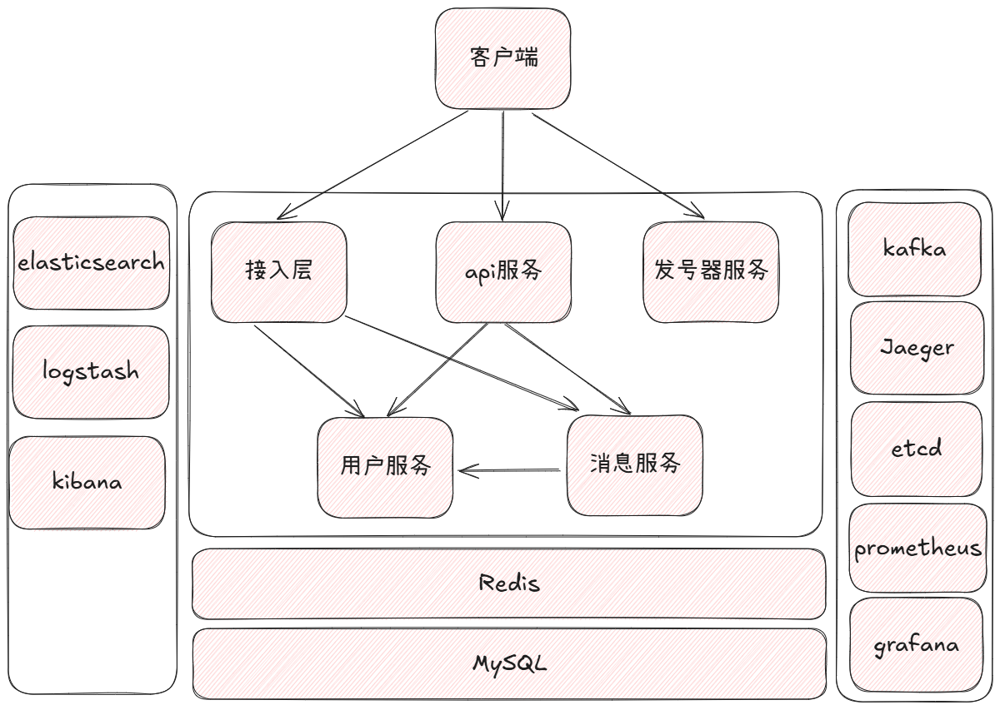
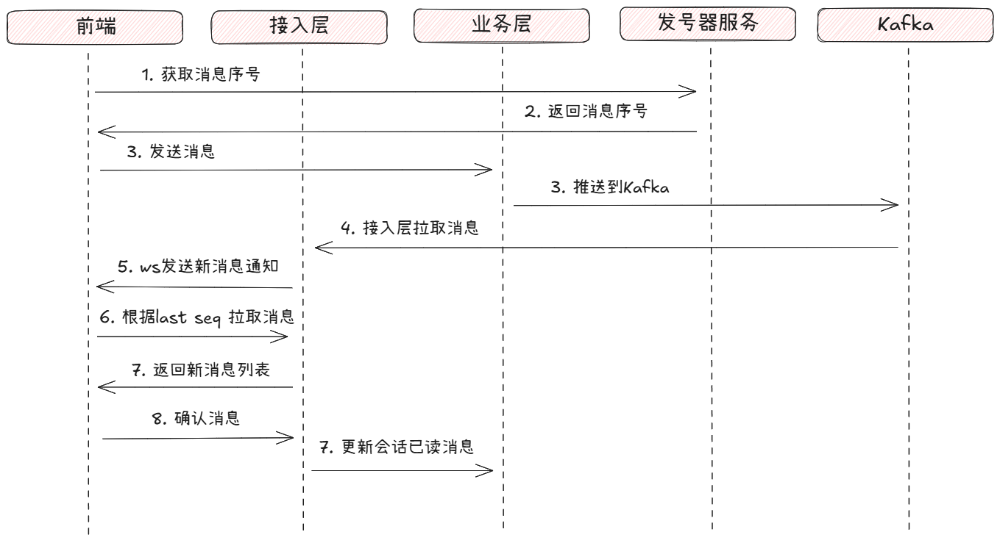
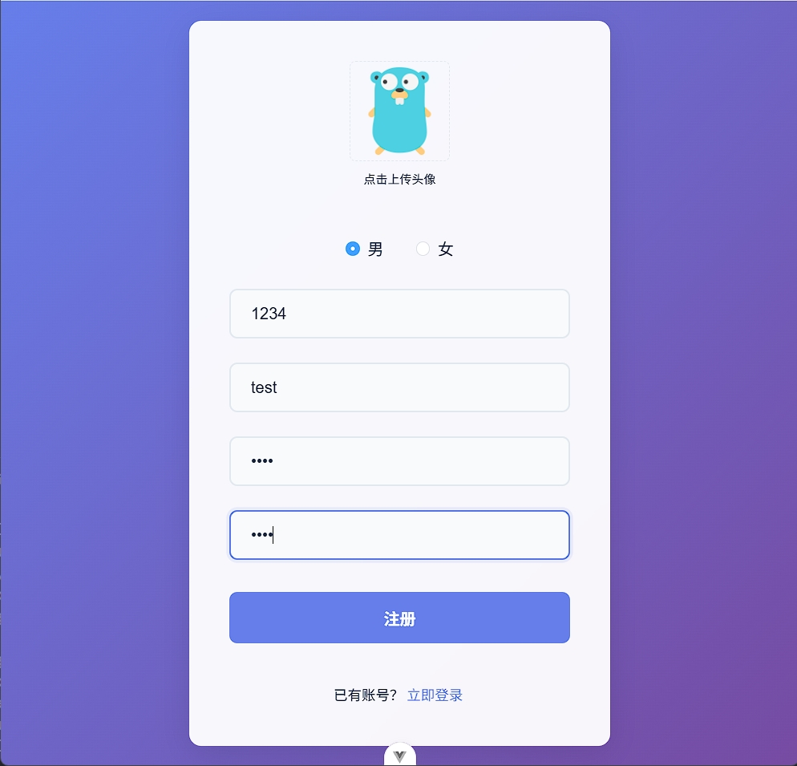
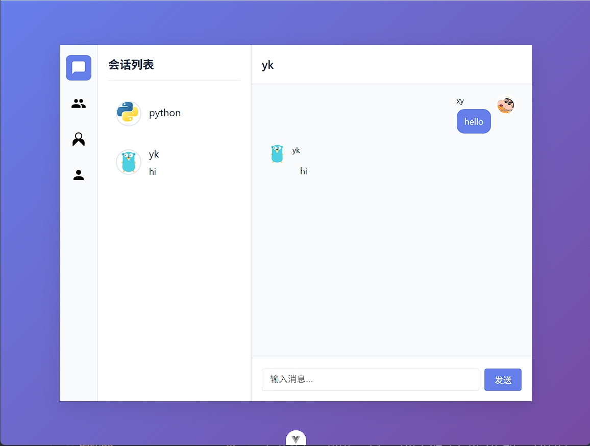
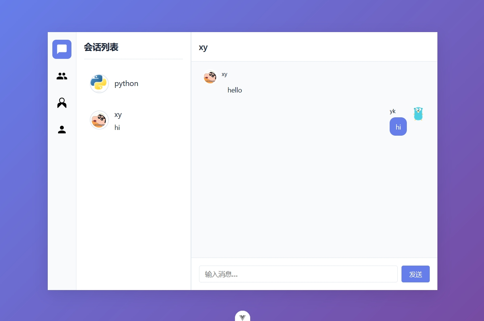
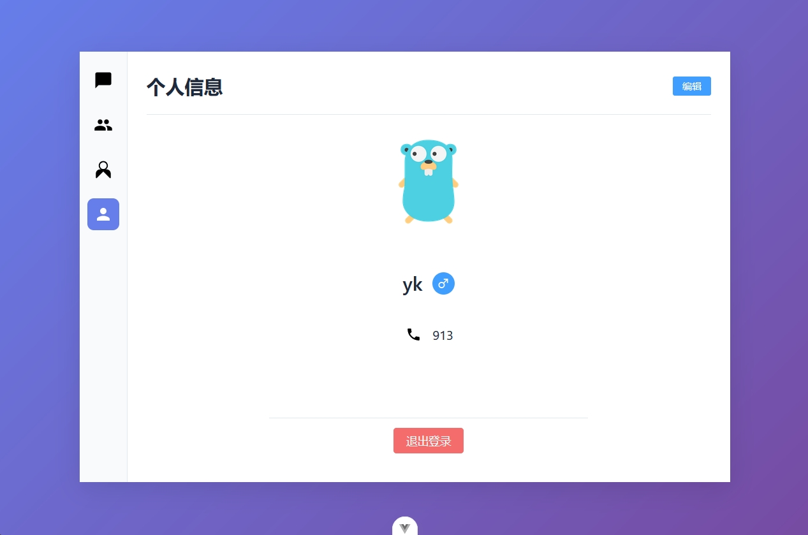

## Introduction
go-im 是基于 Golang + Gin + Gorm 框架实现的即使聊天服务，主要服务与功能：
- api服务
- 用户服务
- 消息服务
- 发号器服务
- 接入层

**api服务**调用/编排下层用户服务、消息服务为前端提供业务接口访问。

**用户服务**提供与用户、好友相关的业务处理，如注册、登录、个人信息、好友申请、好友列表等功能。

**消息服务**提供与包含消息、会话、群组模块的功能，如发送消息、获取聊天会话、创建与获取群组列表等功能。

**发号器服务**用于在发消息时获取会话级别的唯一消息ID，用于保证消息的有序、不丢、不重复。

**接入层服务**前端通过连接接入层，并通过心跳维持在线状态，为前端提供实时的消息通知。

## Features
- Etcd 实现微服务注册与发现
- OpenTelemtry + Jaeger实现微服务之间链路追踪
- Prometheus + Grafana 实现应用指标上传与监控
- ELK 实现分布式日志收集
- ackqueue 实现消息确认和重传
- msgbox 实现会话级别消息信箱
- kafka 支撑高吞吐消息发送

## Arch


api服务、用户服务、消息服务、接入层、发号器服务都是以微服务运行，并通过 etcd 完成服务发现。

api服务、用户服务、消息服务之间通过 grpc 来实现通讯。

接入层与用户服务、消息服务通过 kafka 来实现通知和消息的实时前端推送。


## Sequence Diagram


### 流程说明：

发送消息前从`发号器服务`获取会话级别的消息唯一序号，序号用于保证消息的有序、不重复、不丢。

发送消息时带上序号发送到业务层，业务层将消息保存到数据库，并将消息推送到`Kafka`。

接入层从`Kafka`拉取消息，保存到内存，并发送新消息通知到前端。

前端收到有新消息的通知，根据已读消息的最大ID，向接入层拉取大于该ID的全部消息。

前端收到消息`MsgBox`的设计参考了`Kafka`的消费位移，后，把消息列表中最大的消息ID发送到接入层进行消息确认，接入层再向业务层确认，更新用户会话的最大已读消息ID。

## Design
### AckQueue
`AckQueue`设计在接入层，参考TCP的滑动窗口，实现消息的确认和重传机制。

`AckQueue`内部实现是一条双向链表，每一条连接维护一个`AckQueue`，向前端发送消息时先把消息插入到`AckQueue`末尾，并开启一个超时计时器，当超时时重传消息。

因为消息总是以时间先后插入到链表中，所以链表头的消息一定比后面的消息更早过期。

所以每次只需要监控一个消息的超时计时器，当这个消息到期后再取下一个计时器监听。

消息超时重传后，重置计时器并插到链表末尾。

当前端确认消息后，停止计时器并删除消息。

### MsgList
`MsgList`设计在接入层，实现消息的保存与拉取，用于保证消息的有序性。

`MsgList`的设计参考了`Kafka`的消费位移，会话中的每一个成员维护一个已读消息的最大`ID`，通过这个`ID`从`MsgList`拉取大于这个ID的所有消息。

`MsgList`内部实现是一条双向链表，，每一个`MsgList`保存一个单独会话的消息。

当有新消息到时，把消息插入到链表末尾，并发送通知到前端来拉取新消息。

`MstList`每一条消息维护着一个已读人数，对应会话中的人数，如果全部已读则删除掉该消息释放内存。

### MsgBox
`MsgBox`设计在接入层，内存维护多个`MsgList`桶，通过分片的方式降低`MsgList`的锁竞争。`MsgBox`在接入层只维护一个对象。

每一条新消息通过`会话ID`定位到对应的桶，再通过`会话ID`定位到对应的`MsgList`。


## Deployment
```
Linux 环境：
- Ubuntu 22.04
- MySQL 8.0
- Go 1.23.4
```

### 一. 创建数据表
> CREATE DATABASE goim;
> 
> mysql -uroot -p goim < goim.sql 


### 二. Docker 运行 `Kafka、Redis、Jaeger、Etcd`
#### 运行 Kafka
修改`.env`中`HOST`为主机IP地址，如果是云服务器，则是公网IP地址。

如虚拟机IP：
> HOST=192.168.x.x

运行 Docker 容器
> docker compose -f kafka.yaml up -d
>
> 进入容器：
>
> docker exec -it kafak1 /bin/bash
>
> 创建Topic:
>
> kafka-topics.sh --bootstrap-server localhost:9200 --create --partitions 1 --replicatoin-factor 1 --topic topic-name
>
> topic-name 替换成`cmd/access/config.yaml`中`kafka`配置中对应的`topic`
#### 运行Redis、Jaeger、etcd
> docker compose -f other.yaml up -d
>
> 如果不需要 Jaeger 和 Etcd，将上一条命令换成：
>
> docker compose -f other.yaml up redis -d

> 测试：
>
> kafka-ui:
>
> http://localhost:8090
>
> Jeager-ui:
>
> http://localhost:16686

### 三. Docker 运行 `Promethues、Grafana` (可选)

新建`promethesu.yml`，添加如下内容：
```
global:
  scrape_interval: 15s
  evaluation_interval: 15s

scrape_configs:
  - job_name: 'prometheus'
    static_configs:
      - targets: ['localhost:9090']

  - job_name: 'go'
    static_configs:
      - targets: ['ip:port','ip2:port2']
```
`ip:port`和`ip2:port2`对应替换成你的`/metrics`站点

```如果`Prometheus`在虚拟机中运行，且`go-im`服务运行在主机，需要将容器网络和虚拟机的网络都设置成桥接。```
 
> docker compose -f promethues.yaml up -d

> 测试：
>
> Promethues Web: 
> 
> http://localhost:9090
>
> Grafana Web:
> 
> http://localhost:3000

### 四. 运行 `ELK` (可选)

配置文件中`log`新增`type`为`network`的选项：
```
log:
  level: info
  target:
    -
      type: network
      protocol: tcp
      addr: localhost:5000
```
新建`logstash.conf`:
```
input {
  tcp {
    port => 5000
    codec => json
  }
}

output {
  elasticsearch {
    hosts => ["es:9200"]
    index => "goim-%{+YYYY.MM.dd}"
  }
}
```

> docker compose -f elk.yaml up -d

> 测试：服务启动比较久
> 
> Elasticsearch: 
>
> http://localhost:9200/
> 
> Kibana:
>
> http://localhost:5601

### 五. 编译服务
> make build-all

### 六. 重命名`cmd/*`下每个服务的`config.yaml.example`为`config.yaml`并修改配置

### 七. 启动服务
> ./build/gateway -c cmd/gateway/config.yaml
> 
> ./build/user -c cmd/user/config.yaml
> 
> ./build/message -c cmd/message/config.yaml
> 
> ./build/access -c cmd/access/config.yaml
> 
> ./build/seqserver -c cmd/seqserver/config.yaml

## Demo演示
   - ### 注册
  
   - ### 登录
  
   - ### 聊天会话
  
  
   - ### 个人信息
  

